## JavaScript Projects for Beginners 🚀

Sharpen your JavaScript skills by building projects using Pure JavaScript without any frameworks.
All projects are well structured with comments for explainations and it is very easy to understand every bit of code.

### Project List:

<ol>
    Get All the code from Here: <a href="https://github.com/MaheshGaur04/Multi_Full_Stack_Beginner_Project"</a>Codes
      
    <li>
    
3D Card Animation 😃

    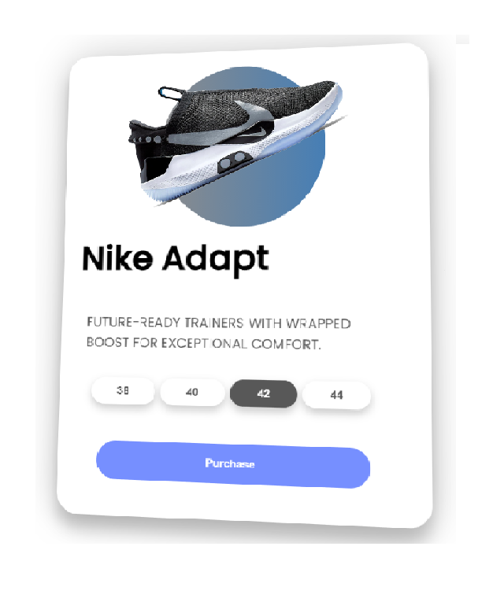 
    </li>
     
    <li>
    
 Analog Clock 🕙

    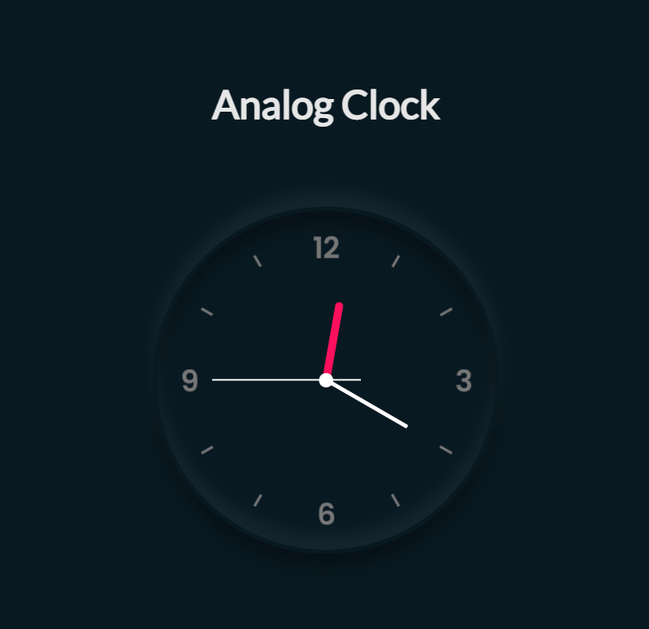
    </li>
     
    <li>
    
BMI Calculator 📲

    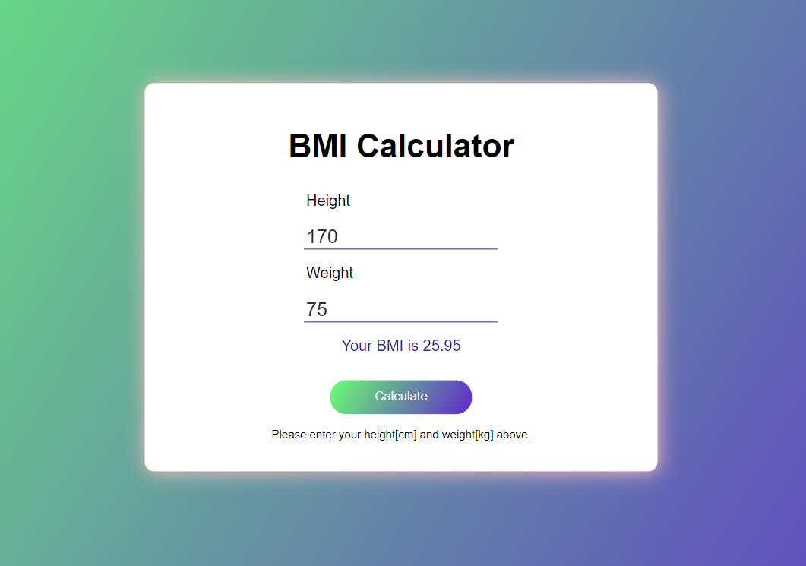
    </li>
     
    <li>
    
 Calculator 📱

    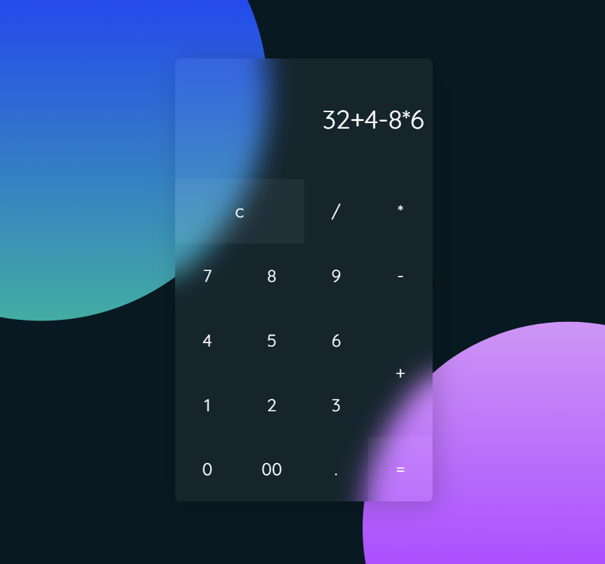
    </li>
     
    <li>
    
 Countdown ⏲️

    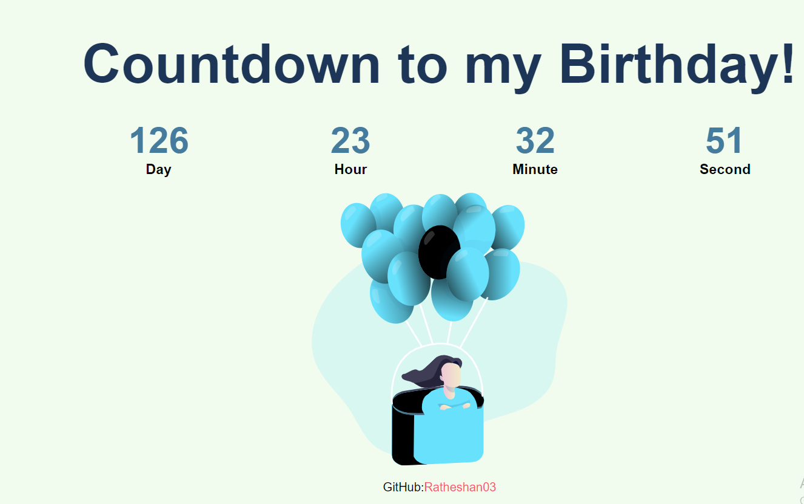
    </li>
     
    <li>
    
 Dynamic Calendar 📅

    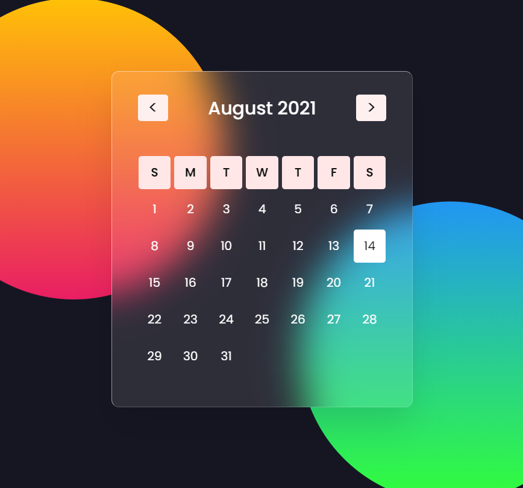
    </li>
     
    <li>
    
 Music Player 🎵

    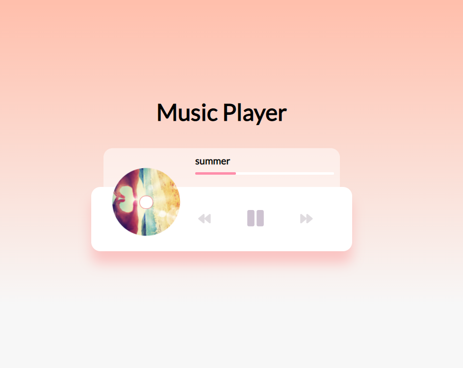
    </li>
     
    <li>
    
 Parallax Website 🍀

    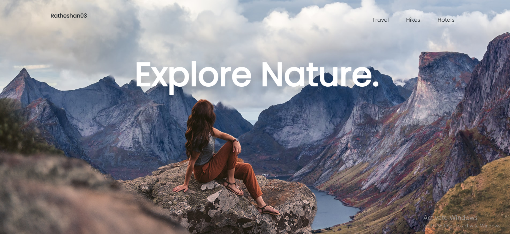
    </li>
     
    <li>
    
 Temperature Converter 🌤️

    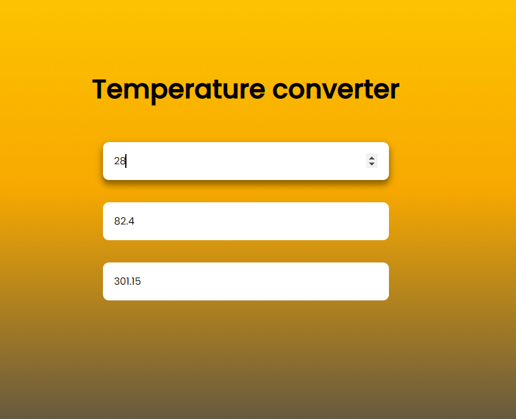
    </li>
     
    <li>
    
Todo list 📖

    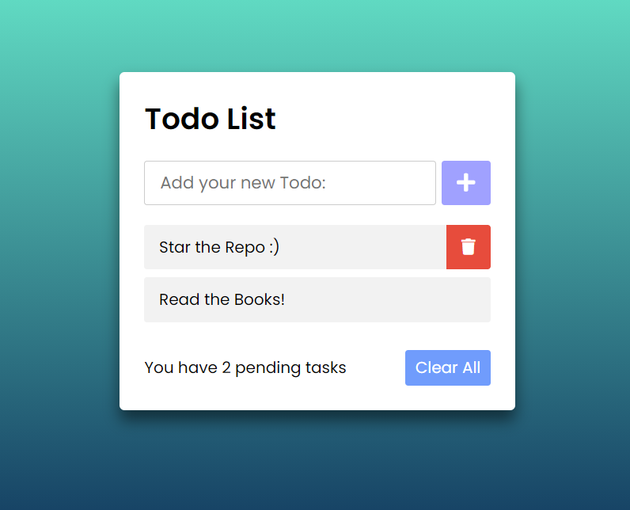
    </li>
     
    <li>
    
 Weather App ⛈️

    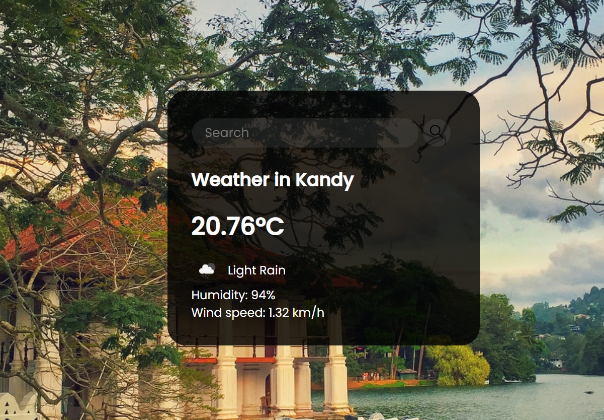
    </li>
     
    <li>
    
  Weight Converter 🙇‍♂️

    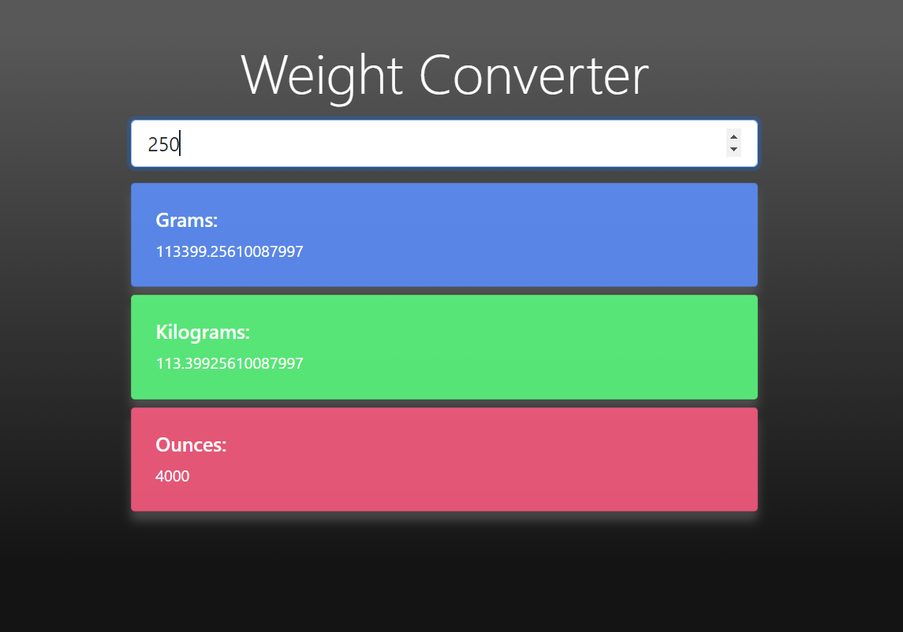
    </li>
     
</ol>

#### And Many more to come... ❕ ❗
